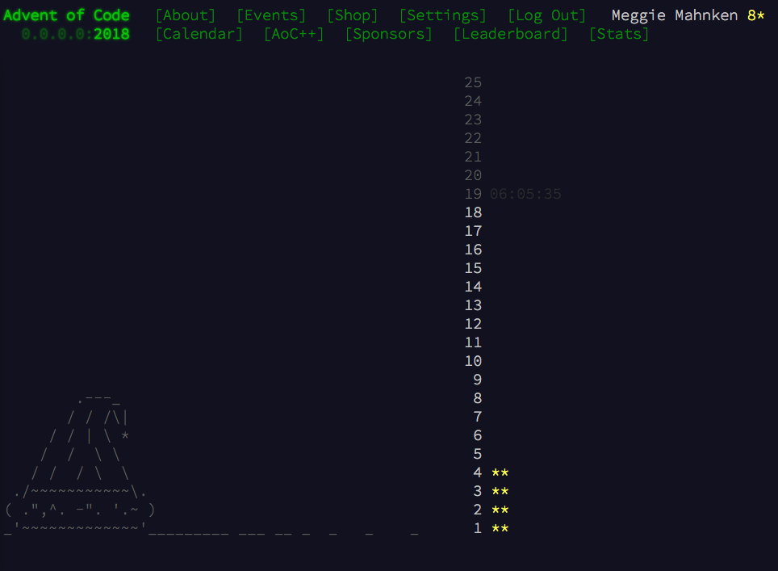

My Solutions for 2018 `Advent of Code <https://adventofcode.com/>`_
===================================================================

If you haven't seen it yet, `Advent of Code <https://adventofcode.com/>`_ 
is a Christmas-themed collection coding challenges, ranging in difficulty from
fairly easy to advanced. I've been participating for the last few 
years, but I haven't always been great about pushing my code. 

Some things I like about Advent of Code:

1. Every day you get two, interrelated challenges. Part 2 is often easier
   to solve if you write maintainable, well-written code for Part 1.

2. The explanations are elaborate, whimsical, and often complicated to the
   point of silliness.

3. The terminal-like UI for the website is adorable. 

4. Some of the problems are difficult because you need to come up with an 
   efficient (wrt runtime) algorithm. Some are difficult because there's a
   messy dataset that needs sanitization. Some are difficult because the
   requirements are full of edge cases. You never know what you'll get.

Here is a screenshot of the UI:

